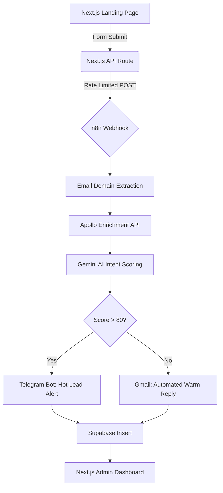

# SaaS Lead Intelligence Pipeline

A high-conversion SaaS landing page coupled with an autonomous AI-driven lead routing pipeline.

## Overview
This project captures inbound leads through a modern, glassmorphic Next.js frontend, pushes them to an n8n webhook, enriches the lead data with Apollo, scores the intent using Google's Gemini AI, and automatically routes the lead. High-intent enterprise buyers get sent to a dedicated Telegram bot for immediate sales engagement, while low-intent leads receive an automated polite rejection or self-serve documentation link via Gmail. All lead data is persisted to a Supabase PostgreSQL database and surfaced in a protected admin dashboard.

## Architecture



## Setup Instructions

### 1. Supabase (Database & Auth)
1. Create a new Supabase project.
2. Run the SQL migration found in `supabase/migrations/001_create_leads_table.sql` in the SQL Editor.
3. Retrieve your `Project URL` and `anon public` key from Settings > API.
4. Set up an Auth provider (e.g., Email with secure passwords).

### 2. n8n (Orchestration)
1. Deploy n8n (e.g., self-hosted via Docker, Render, or Railway).
2. Import the `n8n/workflow.json` file.
3. Configure your credentials within n8n:
   - Supabase connection
   - Gmail OAuth or App Passwords
   - Apollo API Key
   - Gemini API Key
   - Telegram Bot Token & Chat ID
4. Activate the workflow and copy the Production Webhook URL.

### 3. Vercel (Frontend Deployment)
1. Push this repository to GitHub.
2. Import the repository into Vercel.
3. Set the required Environment Variables (see below).
4. Deploy!

## Environment Variables
Create a `.env` (local) or configure Vercel with the following variables:

```env
# Next.js Application Client Keys
NEXT_PUBLIC_SUPABASE_URL=https://your-project-id.supabase.co
NEXT_PUBLIC_SUPABASE_ANON_KEY=eyJhbGciOiJIUzI1NiIsInR5cCI6IkpXVCJ9...

# n8n Pipeline Integration
N8N_WEBHOOK_URL=https://your-n8n-instance.railway.app/webhook/leads
```

*Note: The backend credentials (`APOLLO_API_KEY`, `GEMINI_API_KEY`, `TELEGRAM_BOT_TOKEN`) are managed securely inside your n8n instance and do not need to be exposed to the Next.js frontend.*

## Screenshots

*(Insert screenshot of landing page here)*
``

*(Insert screenshot of the executive dashboard here)*
``
