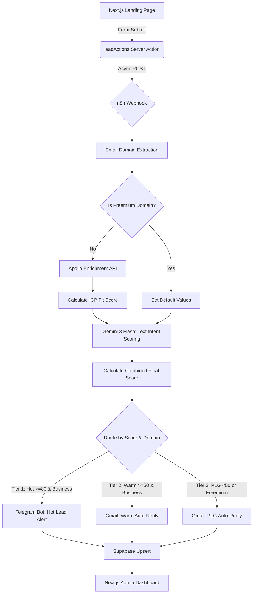

# SaaS Lead Intelligence Pipeline

A high-conversion SaaS landing page coupled with an autonomous AI-driven lead routing pipeline.

## Overview
This project captures inbound leads through a modern, glassmorphic Next.js frontend (using server actions), pushes them to a self-hosted n8n webhook asynchronously, enriches business email domains with Apollo firmographics, programmatically scores the corporate ICP fit, uses Google's Gemini 3 Flash Preview (`gemini-3-flash-preview`) to score raw prospect intent, calculates a combined final score, and routes leads through a 3-tier strategy. Hot enterprise leads (score >= 80) trigger real-time Telegram alerts; warm leads (score >= 50) receive a customized Gmail response referencing their industry; and cold or freemium leads receive a PLG-oriented auto-reply. All data is upserted to a Supabase PostgreSQL database and presented in a protected administrative dashboard.

## Architecture



## Setup Instructions

### 1. Supabase (Database & Auth)
1. Create a new Supabase project.
2. Run the SQL migrations found in the `supabase/migrations` folder in numerical order (001 to 004) in the SQL Editor to provision the leads table, uniqueness constraints, and RLS policies.
3. Retrieve your `Project URL` and `anon public` key from Settings > API.
4. Set up an Auth provider (e.g., Email with secure passwords).

### 2. n8n (Orchestration)
1. Deploy n8n (e.g., self-hosted via Docker, Render, or Railway).
2. Import the `n8n/workflow.json` file.
3. Configure your credentials within n8n:
   - Supabase connection
   - Gmail OAuth or App Passwords
   - Apollo API Key
   - Gemini API Key
   - Telegram Bot Token & Chat ID
4. Activate the workflow and copy the Production Webhook URL.

### 3. Vercel (Frontend Deployment)
1. Push this repository to GitHub.
2. Import the repository into Vercel.
3. Set the required Environment Variables (see below).
4. Deploy!

## Environment Variables
Create a `.env` (local) or configure Vercel/n8n with the following variables:

```env
# Next.js Application Client Keys
NEXT_PUBLIC_SUPABASE_URL=https://your-project-id.supabase.co
NEXT_PUBLIC_SUPABASE_ANON_KEY=eyJhbGciOiJIUzI1NiIsInR5cCI6IkpXVCJ9...

# n8n Pipeline Integration & Security
N8N_WEBHOOK_URL=https://your-n8n-instance.railway.app/webhook/leads
N8N_ENV_VARS_ALLOWED=APOLLO_API_KEY,GEMINI_API_KEY,TELEGRAM_BOT_TOKEN,TELEGRAM_CHAT_ID,SUPABASE_SERVICE_ROLE_KEY
N8N_BLOCK_ENV_ACCESS_IN_NODE=false

# n8n Backend Keys (Set in n8n environment/secrets)
APOLLO_API_KEY=your_apollo_api_key
GEMINI_API_KEY=your_gemini_api_key
TELEGRAM_BOT_TOKEN=your_telegram_bot_token
TELEGRAM_CHAT_ID=your_telegram_chat_id
SUPABASE_SERVICE_ROLE_KEY=your_supabase_service_role_key
```

*Note: The backend credentials (`APOLLO_API_KEY`, `GEMINI_API_KEY`, `TELEGRAM_BOT_TOKEN`) are managed securely inside your n8n instance and do not need to be exposed to the Next.js frontend.*

## Screenshots

*(Insert screenshot of landing page here)*
``

*(Insert screenshot of the executive dashboard here)*
``
